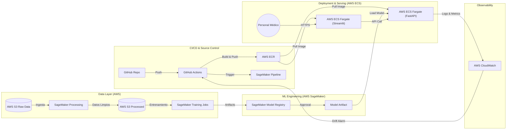

# MLOps End-to-End: Predicción de Enfermedades Comunes y Huérfanas (AWS Edition)

> **Entrega Final - Maestría en IA Aplicada**
> **Autores:** Sandoval & Varela
> **Repositorio:** [Sandoval_Varela-mlops-U2]

## 1. Arquitectura de la Solución

La siguiente arquitectura migra el desarrollo local a un ecosistema Cloud-Native en AWS, garantizando escalabilidad, trazabilidad y gobierno de datos. Se utiliza **GitHub Actions** como orquestador principal de CI/CD, integrando el código existente (FastAPI/Streamlit) con servicios gestionados de ML.

---

## 2. Descripción Detallada del Pipeline (Propuesta MLOps Cloud)

Esta propuesta reestructura el flujo de trabajo para cumplir con los requisitos de validación clínica y manejo de datos sensibles.

### A. Ingesta y Almacenamiento de Datos
* **Descripción:** Centralización de historias clínicas, formularios y registros médicos que actualmente están dispersos. Se asegura el versionamiento de los datos crudos.
* **Tecnología Propuesta:** **AWS S3 (Simple Storage Service)** con estructuración de carpetas `raw/` y `processed/`.
* **Justificación:** S3 ofrece alta durabilidad y actúa como la fuente de verdad inmutable necesaria para auditorías médicas.
* **Estrategia para Enfermedades Huérfanas:** Al centralizar datos en la nube, permitimos la ingesta federada desde múltiples centros médicos, aumentando el volumen de registros para enfermedades raras.

### B. Preprocesamiento y Validación (Data Quality)
* **Descripción:** Ejecución de scripts de limpieza para eliminar duplicados, anonimizar información sensible y normalizar variables numéricas.
* **Tecnología Propuesta:** **AWS SageMaker Processing Jobs**.
* **Justificación:** Permite ejecutar contenedores efímeros para limpiar datos sin mantener servidores encendidos.
* **Estrategia para Enfermedades Huérfanas:** En esta etapa se implementan técnicas de aumento de datos sintéticos (**SMOTE**) para balancear las clases minoritarias antes de que lleguen al modelo.

### C. Entrenamiento y Experimentación
* **Descripción:** Entrenamiento de algoritmos (Árboles, Boosting) probando múltiples hiperparámetros.
* **Tecnología Propuesta:** **AWS SageMaker Training Jobs**.
* **Justificación:** Desacopla el entorno de cómputo. Permite usar instancias potentes (GPU) solo durante el entrenamiento, reduciendo costos.
* **Estrategia para Enfermedades Huérfanas:** Se configura la función de pérdida **Focal Loss** para penalizar más fuertemente los errores en las clases raras, mejorando el recall en diagnósticos poco comunes.

### D. Registro y Versionado de Modelos
* **Descripción:** Gestión del ciclo de vida de los modelos, asegurando que solo modelos validados pasen a producción.
* **Tecnología Propuesta:** **AWS SageMaker Model Registry**.
* **Justificación:** Provee un linaje claro (qué datos entrenaron qué modelo), fundamental para cumplir con normas éticas en salud.

### E. Despliegue de Aplicaciones (Inferencia)
* **Descripción:** Despliegue del Frontend (Streamlit) y Backend (FastAPI) contenidas en Docker.
* **Tecnología Propuesta:** **AWS ECR** (Imágenes) + **AWS ECS Fargate** (Ejecución).
* **Justificación:** Fargate es "Serverless para contenedores". Elimina la necesidad de administrar servidores, reduciendo la carga operativa.

### F. Monitoreo y Reentrenamiento
* **Descripción:** Vigilancia continua del rendimiento y detección de cambios en los datos (Drift).
* **Tecnología Propuesta:** **AWS CloudWatch**.
* **Justificación:** Configuración de alarmas que disparan un nuevo pipeline en GitHub Actions si detectan una caída en la métrica F1-Macro.

---

## 3. Suposiciones y Restricciones

Para garantizar la viabilidad de esta arquitectura, se establecen las siguientes premisas:

1.  **Anonimización en Origen:** Se asume que los datos en S3 ya han pasado por una anonimización básica (sin nombres/cédulas) para cumplir con HIPAA/Habeas Data.
2.  **Conectividad Hospitalaria:** Se asume que los puntos de atención tienen acceso a internet para consumir la API en AWS.
3.  **Estrategia de Reentrenamiento:** El reentrenamiento se dispara por métricas de desempeño (Data Drift detectado en CloudWatch), no por tiempo cronológico.
4.  **Validación Humana:** Si la probabilidad de predicción es < 70%, el Frontend recomendará explícitamente "Revisión por especialista".
5.  **Cold Start:** Se asume la existencia de un dataset histórico mínimo suficiente para el primer entrenamiento supervisado.

---

## 4. CHANGELOG: Evolución del Proyecto (Semana 1 vs. Semana 6)

La siguiente tabla evidencia la maduración técnica del proyecto, pasando de un script local a una plataforma MLOps escalable.

| Característica / Etapa | Semana 1 - 4 (Propuesta Inicial / Local) | Semana 6 (Propuesta MLOps - AWS Cloud) |
| :--- | :--- | :--- |
| **Gestión de Datos** | Archivos CSV locales estáticos. | **AWS S3 (Data Lake)** con versionamiento y segregación (Raw/Processed). |
| **Lógica del Modelo** | Función `if/else` simulada (Dummy). | **Modelo ML Real** (XGBoost/RandomForest) entrenado con manejo de desbalance (SMOTE/Focal Loss). |
| **Entrenamiento** | Ejecución manual en laptop del desarrollador. | **AWS SageMaker Training Jobs** disparados por CI/CD, con instancias optimizadas. |
| **Gestión de Contenedores** | `docker-compose up` local manual. | **AWS ECR** (Registry) + **AWS ECS Fargate** (Orquestación Serverless). |
| **Infraestructura** | Dependiente de la máquina local ("Works on my machine"). | **Infraestructura como Código (IaC)** y despliegue inmutable en la nube. |
| **Monitoreo** | Inexistente (Logs de consola locales). | **AWS CloudWatch** monitoreando latencia, errores y métricas de negocio (Drift). |
| **Pipeline CI/CD** | GitHub Actions básico (solo Pytest). | **GitHub Actions Full**: Test -> Build Image -> Push ECR -> Deploy ECS -> Trigger Training. |
